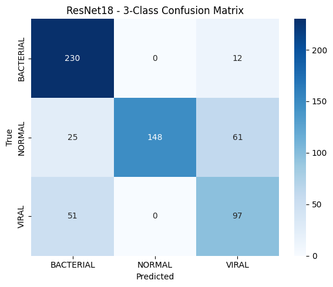
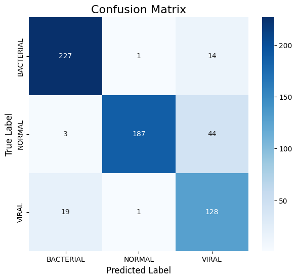
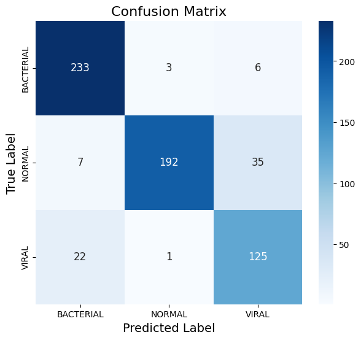
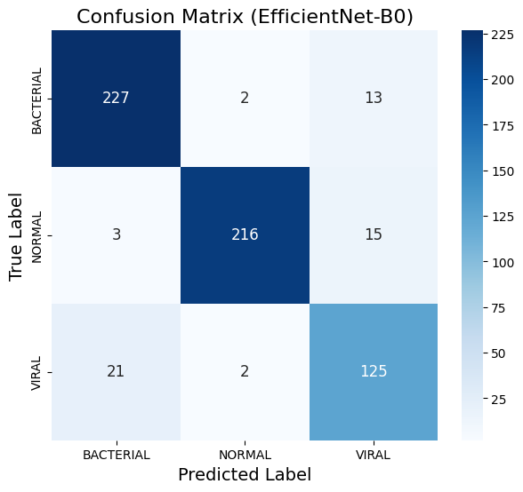
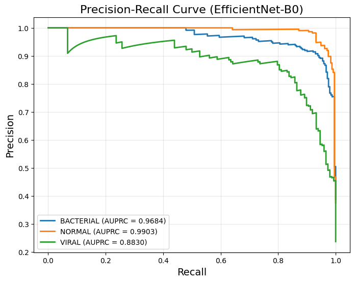
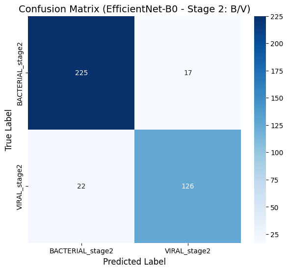
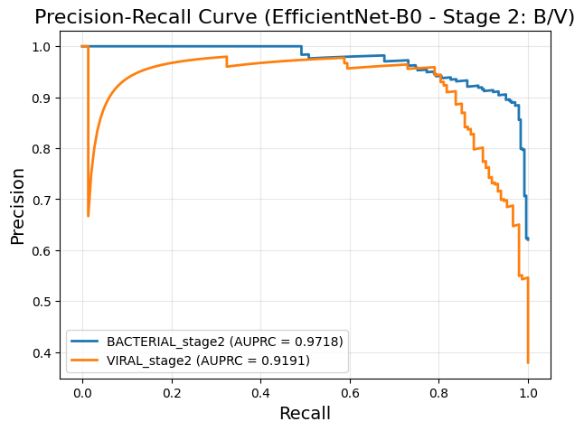

# Chest X-ray Pneumonia Classification: ResNet18 → EfficientNet with Hierarchical Fine-Tuning

A deep learning pipeline for classifying pediatric chest X-rays into three categories — **Normal**, **Bacterial Pneumonia**, and **Viral Pneumonia** — with progressive model improvement from a ResNet18 baseline to a 2-stage EfficientNet hierarchical classifier.

## Project Overview

**Course**: AMS 691 — Medical Image Analysis, Stony Brook University  
**Advisor**: Prof. Chenyu You  
**Team**: 3-member team project  
**My Contribution**: All model architecture design, training pipeline, and evaluation code in this repository — from the initial ResNet18 baseline through EfficientNet transfer learning to the 2-stage hierarchical classifier.  
**Note**: This repository contains only my contributions. Data collection and exploratory analysis were handled by other team members.

## Full Project Scope

The team explored five CNN architectures in parallel to find the best-performing 3-class classifier for this dataset. Each member independently designed, trained, and evaluated their assigned models, then results were compared across the team.

| Architecture | Contributor | Best 3-Class Acc | Notes |
|---|---|---|---|
| VGG16 | Team member | 89.8% | Full-dataset training outperformed undersampled; 2-stage specialization tested |
| AlexNet | Team member | ~85% | Balanced vs. unbalanced protocol comparison; subset retraining explored |
| DenseNet-121 | Team member | 81% (3-class), 98% (binary) | Strong at Normal/Diseased separation; struggled with Bacterial/Viral boundary |
| **ResNet18** | **Me (this repo)** | **88.1%** | Iterative improvement: baseline → dropout + augmentation → WeightedRandomSampler + AdamW |
| **EfficientNet-B0/B1** | **Me (this repo)** | **~91%** | Transfer learning with 3-ch input; 2-stage hierarchical fine-tuning for VIRAL recall |

A common finding across all models: distinguishing **Bacterial vs. Viral pneumonia** was the hardest sub-task, motivating the 2-stage hierarchical approach implemented in this repository.

## Pipeline

```
Raw Dataset (2-class)
  │
  ▼
Data Reorganization ──→ 3-class (NORMAL / BACTERIAL / VIRAL)
  │
  ▼
┌─────────────────────────────────────────────────────────┐
│  Stage 1: Iterative Model Improvement                   │
│                                                         │
│  ResNet18 Baseline (76% acc)                            │
│    → Diagnosed: class imbalance, no augmentation        │
│    → Added: Dropout, ClassWeights, Augmentation         │
│  ResNet18 Improved (83% acc)                            │
│    → Added: WeightedRandomSampler, AdamW                │
│  ResNet18 + WRS + AdamW (83.6% acc)                     │
│    → Architecture shift: EfficientNet-B0 (3-ch input)   │
│  EfficientNet-B0 (85.3% val acc)                        │
│  EfficientNet-B1 (85.8% val acc)                        │
└──────────────────────────┬──────────────────────────────┘
                           │
                           ▼
┌─────────────────────────────────────────────────────────┐
│  Stage 2: Hierarchical Fine-Tuning                      │
│                                                         │
│  Load Stage 1 (B0) feature backbone                     │
│    → Train new head: BACTERIAL vs VIRAL only             │
│    → VIRAL Recall: 0.845 → 0.884                        │
│    → Reduced cross-class misclassification               │
└─────────────────────────────────────────────────────────┘
```

## Dataset

| Split | NORMAL | BACTERIAL | VIRAL | Total |
|-------|--------|-----------|-------|-------|
| Train | 1,349  | 2,538     | 1,345 | 5,232 |
| Val   | 20% stratified split from Train | | | 1,047 |
| Test  | 234    | 242       | 148   | 624   |

- **Source**: [Kaggle Pediatric Chest X-ray](https://data.mendeley.com/datasets/rscbjbr9sj/2)
- **Citation**: Kermany et al., *Cell* 172(5), 2018
- Original 2-class (NORMAL/PNEUMONIA) → reorganized to 3-class by filename pattern

## Results Summary

| Model | Val Acc | AUROC (weighted) | F1: BACT | F1: NORM | F1: VIRAL |
|-------|---------|------------------|----------|----------|-----------|
| ResNet18 Baseline | 76.0% | — | 0.84 | 0.77 | 0.61 |
| ResNet18 Improved | 83.0% | 0.9713 | 0.9246 | 0.8930 | 0.7962 |
| ResNet18 + WRS + AdamW | 83.6% | 0.9728 | 0.9298 | 0.8954 | 0.8011 |
| EfficientNet-B0 | 85.3% | 0.9631 | 0.9176 | 0.8782 | 0.7855 |
| EfficientNet-B1 | 85.8% | 0.9680 | 0.9142 | 0.8861 | 0.7910 |
| **2-Stage (B0 → BV head)** | — | — | retained | — | **↑ Recall +3.9pp** |

Key finding: Viral pneumonia is the hardest class due to subtle radiographic differences from bacterial pneumonia. The 2-stage approach specifically targets this confusion boundary.

### ResNet18: Baseline → Improved → Best

The baseline (left) shows heavy NORMAL→VIRAL confusion (61 cases) due to class imbalance and no augmentation. After adding dropout, augmentation, and class-weighted loss (center), NORMAL recall improves from 148 to 187. With WeightedRandomSampler, AdamW, and layer freezing (right), ResNet18 reaches its ceiling at 88.1% — but NORMAL→VIRAL leakage (35 cases) persists.

<p align="center">
  
  
  
</p>

### EfficientNet-B0: Architecture Upgrade

Switching to EfficientNet-B0 with 3-channel input and ImageNet normalization pushes accuracy to ~91%. NORMAL correct predictions reach 216 (vs. 192 in best ResNet18), and the per-class AUPRC confirms VIRAL (0.883) as the most challenging class.

<p align="center">
  
  
</p>

### 2-Stage Hierarchical Fine-Tuning

The Stage 2 model, trained exclusively on BACTERIAL/VIRAL samples with the Stage 1 feature backbone, achieves 90.0% accuracy on the binary sub-task with AUROC 0.9552. VIRAL F1 improves from 0.831 → 0.866 (+3.5pp), precision from 0.817 → 0.881 (+6.4pp).

<p align="center">
  
  
</p>

## Project Structure

```
pneumonia-xray-classification/
├── config.py              # Hyperparameters, seeds, device setup
├── train.py               # Unified training with history logging
├── evaluate.py            # Classification report, confusion matrix, AUROC, AUPRC
├── inference.py           # Single-image prediction with confidence visualization
├── gradcam.py             # Grad-CAM heatmap generation (single + batch mode)
├── visualize.py           # Training curves, multi-model comparison charts
├── requirements.txt
├── figures/               # Confusion matrices, precision-recall curves
├── data/
│   ├── reorganize.py      # 2-class → 3-class dataset conversion
│   └── dataset.py         # Transforms, DataLoaders, WeightedRandomSampler, Stage2 dataset
└── models/
    ├── resnet18.py         # Baseline, Improved (dropout), Frozen (feature extraction)
    └── efficientnet.py     # B0, B1, Stage2 hierarchical head
```

## Usage

### 1. Prepare Dataset

```bash
# Download from Kaggle, then reorganize
python data/reorganize.py --src /path/to/chest_xray --dst /path/to/chest_xray_3class
```

### 2. Train Models

```bash
# ResNet18 baseline (grayscale, no regularization)
python train.py --model resnet18_baseline --data_root /path/to/chest_xray_3class

# ResNet18 improved (dropout + class weights + augmentation)
python train.py --model resnet18_improved --data_root /path/to/chest_xray_3class

# EfficientNet-B0 (3-channel, full fine-tuning)
python train.py --model efficientnet_b0 --data_root /path/to/chest_xray_3class

# Stage 2: hierarchical BACTERIAL/VIRAL classifier
python train.py --model stage2 --data_root /path/to/chest_xray_3class \
    --stage1_ckpt ./checkpoints/efficientnet_b0_best.pth
```

### 3. Evaluate

```bash
python evaluate.py --model efficientnet_b0 \
    --checkpoint ./checkpoints/efficientnet_b0_best.pth \
    --data_root /path/to/chest_xray_3class \
    --output_dir ./results
```

### 4. Grad-CAM Visualization

```bash
# Single image — see where the model is "looking"
python gradcam.py --model efficientnet_b0 \
    --checkpoint ./checkpoints/efficientnet_b0_best.pth \
    --image /path/to/xray.jpeg \
    --output_dir ./results/gradcam

# Batch mode — grid across all classes
python gradcam.py --model efficientnet_b0 \
    --checkpoint ./checkpoints/efficientnet_b0_best.pth \
    --image_dir /path/to/chest_xray_3class/test \
    --output_dir ./results/gradcam
```

### 5. Single-Image Inference

```bash
python inference.py --model efficientnet_b0 \
    --checkpoint ./checkpoints/efficientnet_b0_best.pth \
    --image /path/to/xray.jpeg \
    --gradcam
```

### 6. Compare Training Histories

```bash
# After training multiple models, compare convergence and performance
python visualize.py --history_dir ./checkpoints --output_dir ./results
```

## Technical Details

### Class Imbalance Strategy
- **WeightedRandomSampler**: oversamples minority classes (VIRAL) to produce balanced mini-batches
- **Class-weighted CrossEntropyLoss**: inverse-frequency weights penalize misclassification of rare classes

### Augmentation Pipeline
Designed to simulate realistic clinical variations in chest radiographs:
- `RandomHorizontalFlip(p=0.5)` — left-right anatomical symmetry
- `RandomRotation(15°)` — minor positioning differences
- `ColorJitter(brightness=0.2, contrast=0.2)` — X-ray exposure variation
- `RandomAffine(translate=0.1)` — positional shifts

### Grad-CAM Interpretability
Generates activation heatmaps from the last convolutional layer to validate that the model attends to clinically relevant lung regions rather than image artifacts or labels. Supports both single-image and batch-grid visualization modes.

### Reproducibility
All experiments use `seed=42` across PyTorch, NumPy, and Python random.

```python
torch.manual_seed(42)
random.seed(42)
np.random.seed(42)
```

**Note on result variance**: The results reported above were obtained on Google Colab with an A100 GPU (CUDA). Running the same code on a different hardware backend (e.g., Apple MPS, different CUDA GPU, or CPU) may produce slightly different results (typically ±1–2%p) due to differences in floating-point arithmetic across GPU architectures, non-deterministic cuDNN algorithm selection, and variations in PyTorch/torchvision versions. This is a known limitation of deep learning reproducibility, not a code-level issue. To minimize variance on CUDA, set `torch.backends.cudnn.deterministic = True` and `torch.backends.cudnn.benchmark = False`, though this may reduce training speed.

## Environment

- Python 3.8+
- PyTorch >= 1.11 / torchvision >= 0.13
- Compatible with: CUDA, Apple MPS (M1/M2), CPU
- Developed on: Google Colab (A100) + MacBook Pro M2

## License

This work was completed as part of the AMS 691 Medical Image Analysis course at Stony Brook University. Intended for academic research use.
